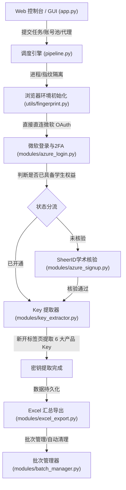

# Azure Key Extractor (Outlook / Education) 全流程项目详细技术说明文档

## 📖 一、 项目简介与架构概述

本项目是一套面向 **Microsoft Azure for Students (学生教育资格与软件密钥自动提取)** 的全自动化 RPA 流程引擎与可视化平台。项目通过 Playwright 驱动真实无头/有头 Chromium 浏览器，高度拟人化模拟人类操作，完成从 **微软账号登录、2FA/TOTP 多因素认证自动化绑定与核验、SheerID 学术资格认证、Azure Education 控制台协议自动化签署、到 6 款核心软件密钥（Windows / Visio / Project 等）提取与 Excel 汇总导出** 的全链路闭环。

---

## 🏗️ 二、 系统核心模块拓扑



---

## 🔁 三、 核心业务全链路步骤详解（每一步在做什么？下一步怎么做？）

### 步骤 0：环境与网络准备阶段
* **0.1 代理与链路分配**：
  * 系统支持 SOCKS5 / HTTP 代理池以及 VLESS 本地 Xray 前置代理。
  * 每个账号分配独立的代理链路，杜绝多账号同 IP 关联风控。
* **0.2 浏览器指纹伪装（`utils/fingerprint.py`）**：
  * 通过 Chrome DevTools Protocol (CDP) 注入底层指纹覆盖脚本。
  * 伪装真实 WebGL 渲染管线、AudioContext、屏幕分辨率、硬件并发数、电池状态与平台标识。
  * 原生修正 `navigator.webdriver = false`，保证 `Function.prototype.toString` 不被 Arkose / Turnstile 风控脚本识破。
* **0.3 省流与静态资源拦截**：
  * 本地硬盘缓存公共脚本库，拦截不必要的图片、视频与字体文件，节省 70%~85% 网络流量。
  * **白名单绝对放行**：对微软登录、Arkose 验证码、SheerID 域名实行 100% 豁免，确保业务不被误拦截。

---

### 步骤 1：微软账号登录流程（`modules/azure_login.py`）

* **1.1 直连登录入口**：
  * 浏览器导航至 `https://signup.azure.com/api/user/login`，毫秒级 302 重定向至微软官方 OAuth 页面，免去加载前端非必要大文件的耗时。
* **1.2 账号输入**：
  * 定位 `input[type="email"]` 或 `#i0116`。
  * 使用拟人化逐字击键（`press_sequentially`，带有 20~50ms 真实物理延迟）填入账号，触发 `input` / `change` 事件并敲击 `Enter` 或点击 Next。
* **1.3 密码输入**：
  * 等待页面平滑过渡到密码框 `input[type="password"]` 或 `#i0118`。
  * 移动鼠标模拟真人悬停点击，逐字输入密码，触发 Knockout 数据绑定，点击 `Sign in` 提交。
* **1.4 多因素认证（MFA / 2FA）响应式状态机**：
  若账号首次登录或需要绑定 2FA，系统启动智能状态机（`_handle_mfa_setup`），每 0.5 秒扫描当前屏幕特征并流转：
  1. **`keep_secure`（提示保护账号安全）**：点击 Next 推进。
  2. **`install_auth`（提示安装微软验证器）**：自动点击「*I want to use a different authenticator app*」切换至标准 TOTP 验证器。
  3. **`setup_account`（设置账号）**：点击 Next 推进至二维码/密钥界面。
  4. **`scan_qr`（二维码界面）**：自动点击「*Can't scan the QR code?* / *无法扫描二维码*」展开明文 Base32 密钥。
  5. **`show_secret`（密钥展示界面）**：
     - 通过 5 重 DOM 遍历算法（精确定位 Secret Key 节点、排除黑名单短语、Base32 编码校验）提取 16~32 位 TOTP Secret。
     - 提取成功后点击 Next 推进到验证码输入页。
  6. **`enter_code`（输入验证码界面）**：
     - 使用提取到的 Secret 通过 `pyotp.TOTP(secret).now()` 本地实时计算 6 位动态验证码。
     - 拟人化键入验证码并敲击 Enter 提交验证。
  7. **`done`（注册成功界面）**：
     - 检测到 `Notification approved` / `Great job` / `successfully registered` / `Authenticator app added` 时，判定绑定成功，点击 `Next / Done` 推进。
  8. **`kmsi`（保持登录状态提示）**：
     - 出现「*Stay signed in?*」界面时，自动点击「*No*」或「*否*」，完成鉴权并释放页面跳转。
* **下一步走向**：登录与 2FA 完成后，进入 **步骤 2（状态分流）**。

---

### 步骤 2：业务类型判断与状态分流（`modules/pipeline.py`）

* **2.1 页面 URL 与 DOM 探测**：
  * 检测最终跳转的落地页面特征。
* **2.2 分流规则**：
  * **分支 A（已开通 / 已认证）**：若账号之前已通过学生资格核验，或直接重定向至 `portal.azure.com` / `education.azure.com`，系统直接跳过 SheerID，进入 **步骤 4（提 Key）**。
  * **分支 B（未核验）**：若页面停留在 `signup.azure.com/studentverification`，系统进入 **步骤 3（SheerID 学术核验）**。

---

### 步骤 3：SheerID 学术资格核验（`modules/azure_signup.py`）

* **3.1 等待表单渲染**：
  * 等待 `#sse-vnext-fname-input` 渲染就绪（最多等待 60 秒）。
* **3.2 拟人化填写表单**：
  * **First Name / Last Name**：从美式常用人名库中随机选取并物理输入。
  * **Country**：默认保持 `United States`。
  * **Date of Birth**：随机生成 1997~2002 年份的出生日期，通过 JS 写入并触发原生 `input` / `change` / `blur` 事件。
  * **School Email**：系统自动校验微软预填充的 edu 邮箱，若已填好则不重复录入。
* **3.3 等待 Verify 按钮激活变蓝（`_btn_js`）**：
  * 循环检测 `#sse-vnext-submit-button` 的真实状态（90 轮 × 1 秒）。
  * 必须满足：`disabled=false`、无 `aria-disabled`、`pointerEvents != 'none'` 且 `opacity >= 0.6`（代表 Turnstile 人机验证已静默通过、按钮已变成可用蓝色）。
* **3.4 点击提交与 `_DONE_JS` 响应等待**：
  * 鼠标悬停并点击 `Verify academic status` 按钮。
  * 等待页面产生响应（检测 `confirming your account` / `verification email has been sent` / `unable to confirm your university id` / `your profile` / `first name` / `verification complete`）。
* **3.5 结果确认等待（20 轮 × 3 秒 = 60 秒）**：
  * **审核中过渡**：若页面处于 `confirming your account` 或 `setting up`，持续稳定等待其完成。
  * **核验成功**：若检测到 `portal.azure.com` / `education.azure.com` / `your profile` / `first name` / `verification complete` / `verification email has been sent`，判定核验成功！
  * **拒审/异常**：若检测到 `unable to confirm your university id` / `unable to verify` / `you do not have access`，判定未通过并自动刷新页面重试（最多 3 次）。
* **下一步走向**：核验成功后，直接进入 **步骤 4（提 Key）**。

---

### 步骤 4：新开标签页并发提取 Key（`modules/key_extractor.py`）

* **4.1 新开独立标签页导航**：
  * 为防止 SPA 页面历史路由污染，脚本新开干净的 Tab 标签页直接导航至：
    `https://portal.azure.com/#view/Microsoft_Azure_Education/EducationMenuBlade/~/software`
* **4.2 自动化签署协议（Terms Acceptance）**：
  * 首次进入 Education 软件中心时，页面会弹出使用条款签署弹窗。
  * 脚本自动穿透定位并勾选 `.ms-Checkbox-checkbox` 协议复选框，派发 React 合成点击事件，点击「*Accept and continue*」完成激活入库。
* **4.3 遍历 6 大核心产品密钥**：
  系统配置提取以下 6 款微软软件：
  1. `Visio Professional 2021`
  2. `Project Professional 2021 - DVD`
  3. `Windows Server 2022 Standard (updated July 2023)`
  4. `Windows Server 2025 Standard`
  5. `Windows Server 2019 Standard (updated Mar 2023)`
  6. `Windows 11 Education, version 25H2`
* **4.4 单产品提取核心逻辑**：
  1. **精确搜索**：在软件列表搜索框输入完整产品名称。
  2. **列表项点击**：在搜索结果列表中点击目标产品行，唤出右侧抽屉面板（Blade Panel）。
  3. **查看密钥（View Key）**：
     - 递归穿透原生 DOM 与多层 Shadow DOM，定位并点击「*View Key* / *查看密钥*」按钮。
     - 等待后端 API 请求返回 25 位产品密钥（格式：`XXXXX-XXXXX-XXXXX-XXXXX-XXXXX`）。
  4. **拟人化防风控延迟**：提取完一个产品后随机休眠 1.2s ~ 2.5s，模拟真人阅读节奏，防止高并发触发微软 Azure RP 接口速率限制。
* **下一步走向**：6 款产品提取完毕后，汇总数据进入 **步骤 5（持久化与导出）**。

---

### 步骤 5：数据持久化与 Excel 导出（`modules/excel_export.py`）

* **5.1 内存与文件持久化**：
  * 提取到的密钥以 JSON 格式追加写入 `results/keys_result.json`，防止程序意外中断丢失进度。
* **5.2 格式化 Excel 导出**：
  * 自动在 `results/` 目录下生成 `Azure_Keys_YYYYMMDD_HHMMSS.xlsx`。
  * 表头包含：`账号邮箱`、`密码`、`TOTP Secret`、`6款产品密钥列`、`提取状态`、`完成时间`。
* **下一步走向**：进入 **步骤 6（批次调度与循环）**。

---

### 步骤 6：批次管理与内存回收（`modules/batch_manager.py`）

* **6.1 批次分割**：
  * 将大批量账号拆分为默认 15 个账号一组的批次。
* **6.2 垃圾回收与防泄露**：
  * 单批次处理完毕后，主动关闭所有 BrowserContext、清理本地临时 Cache，释放内存。
* **6.3 自动重启**：
  * 根据配置（`AUTO_RESTART_ON_BATCH` / `AUTO_RESTART_ON_COMPLETE`），在批次完成或全部完成后优雅退出并自动拉起新进程，保证 VPS 长期无人值守运行的极致稳定性。

---

## ⚙️ 四、 核心配置文件说明（`config.py`）

| 配置项 | 默认值 | 作用说明 |
| :--- | :--- | :--- |
| `HEADLESS` | `False` | 是否启用无头浏览器（生产 VPS 部署建议 `True`，本地调试建议 `False`） |
| `ENABLE_SAVE_DATA` | `True` | 是否开启省流模式（本地缓存常用脚本，阻断无用媒体） |
| `PROXY` | `None` | SOCKS5 / HTTP 代理字符串（支持代理池轮换） |
| `VLESS_PROXY` | `None` | VLESS 协议前置代理配置（适用于国内服务器） |
| `CONCURRENCY` | `1` | 并发浏览器实例数 |
| `BATCH_SIZE` | `15` | 每批次执行账号数，达到后自动执行批次清理与重启 |
| `PAGE_LOAD_TIMEOUT` | `90000` | 页面加载最大超时（毫秒） |
| `PORTAL_WAIT` | `120` | Azure Portal SPA 前端框架最大加载等待时间（秒） |

---

## 🚀 五、 部署与运行指南

### 1. Windows 本地环境
1. 双击运行根目录下的 `一键启动.bat`。
2. 浏览器访问本地 Web 控制台：`http://127.0.0.1:5000`。
3. 导入账号列表与代理配置，点击「开始运行」，控制台将通过 SSE 实时打印高精度彩色进度日志。

### 2. Linux VPS 服务器部署
1. 解压项目压缩包至 VPS。
2. 安装依赖并启动：
   ```bash
   pip install -r requirements.txt
   playwright install chromium
   python run_gui.py
   ```
3. 在后台挂载运行（如使用 `systemd` 或 `screen` / `tmux`）。
